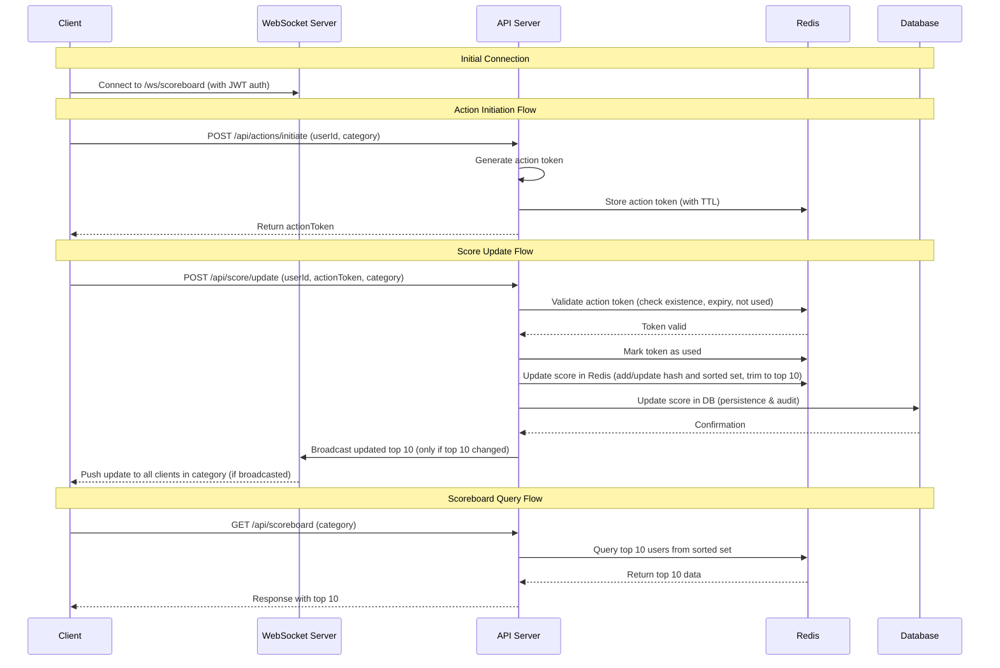
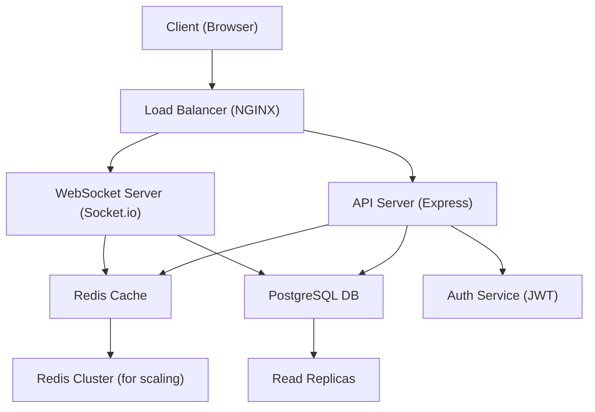

# Scoreboard API Module Specification

## Overview

This module handles the backend API for a live-updating scoreboard system. It manages user scores using Redis as the primary data store for the leaderboard, provides endpoints for score updates, and broadcasts real-time updates to connected clients to maintain a live scoreboard displaying the top 10 users. The scoreboard is retrieved directly from Redis for optimal performance.

## Assumptions

-   Users are pre-registered and authenticated via JWT tokens issued by a separate authentication service
-   Action tokens are generated server-side upon action initiation (e.g., via a POST /api/actions/initiate endpoint that returns the token to the frontend). The frontend includes this token in the score update request to prove completion.
-   The system uses PostgreSQL as the database for persistence and audit logging, with Redis as the primary data store for the leaderboard and real-time score management
-   Real-time updates are critical, so WebSocket is preferred over polling mechanisms
-   The scoreboard only displays the top 10 users; no pagination or filtering is required

## Action Token Generation

Action tokens must be cryptographically secure to prevent forgery. Generate tokens using a combination of user ID, timestamp, and a server-side secret key with HMAC-SHA256 signing. Tokens should include:

-   User ID
-   Expiration timestamp (max 5 minutes)
-   Unique nonce to prevent reuse
-   HMAC signature for integrity

Example pseudocode:

```javascript
const crypto = require("crypto");

function generateActionToken(userId) {
	const payload = {
		userId,
		exp: Date.now() + 5 * 60 * 1000, // 5 minutes
		nonce: crypto.randomUUID(),
	};
	const message = JSON.stringify(payload);
	const signature = crypto
		.createHmac("sha256", process.env.SECRET_KEY)
		.update(message)
		.digest("hex");
	return Buffer.from(message + "." + signature).toString("base64");
}
```

Tokens are stored in Redis with TTL for validation and marked as used after consumption.

## Constraints

-   Action tokens must be valid for a maximum of 5 minutes to prevent reuse
-   Rate limit: Maximum 10 score updates per user per minute, implemented using Redis-based sliding window (e.g., via libraries like `express-rate-limit` with Redis store)
-   Scoreboard updates must be propagated in real-time with minimal latency (< 1 second)
-   System must be secure against common attacks including CSRF, XSS, and injection vulnerabilities
-   API must handle up to 10,000 concurrent users with acceptable performance

## Trade-offs and Alternatives

### Real-time Updates: WebSocket vs Polling vs Server-Sent Events (SSE)

-   **WebSocket (Chosen)**: Low latency (<1s), bidirectional, ideal for live updates. Trade-off: Higher complexity in scaling (sticky sessions), resource-intensive for long connections.
-   **Alternatives**:
    -   **Polling**: Simple, no server state, but high latency (e.g., 5-10s poll interval) and wasteful bandwidth. Suitable if WebSocket fails or for low-traffic scenarios.
    -   **SSE**: Unidirectional, lower overhead than WebSocket, but not bidirectional. Good for server-to-client push without full WebSocket.
-   **Recommendation**: Use WebSocket as primary, with SSE/polling fallback for clients without WebSocket support.

### Data Store Strategy: Redis Primary vs Database Primary

-   **Redis Primary (Chosen)**: Redis sorted sets manage the leaderboard directly, with database for persistence. Trade-off: Potential data loss if Redis fails without proper backup; requires dual writes.
-   **Alternative: Database Primary**: Database stores scores, Redis caches top 10. Trade-off: Cache misses require DB queries, potential latency.
-   **Decision**: Redis primary for sub-millisecond leaderboard queries; database ensures durability.

### Rate Limiting: Sliding Window vs Fixed Window

-   **Sliding Window (Chosen)**: Smooth rate limiting, prevents burst attacks. Trade-off: More complex implementation (Redis sorted sets).
-   **Alternative: Fixed Window**: Simpler, but allows bursts at window boundaries.
-   **Trade-off**: 10 updates/min is conservative; adjust based on business (e.g., gaming might allow higher for engagement).

### Consistency vs Availability (CAP Theorem)

-   **Eventual Consistency**: Score updates are eventually consistent across cache/DB/WebSocket. Trade-off: Temporary inconsistencies (e.g., scoreboard shows old data briefly).
-   **Strong Consistency**: Use transactions for immediate consistency. Trade-off: Higher latency, reduced availability under load.
-   **Decision**: Eventual consistency for performance; monitor and alert on inconsistencies.

## Requirements

### Functional Requirements

1. **Scoreboard Display**: Provide an endpoint to retrieve the current top 10 users by score, optionally filtered by category (e.g., game type, region).
2. **Score Update**: Allow authenticated users to update their scores via API call after completing an action, supporting multiple categories.
3. **Live Updates**: Broadcast score changes to all connected clients in real-time for each category.
4. **Security**: Prevent unauthorized score increases through proper authentication and validation.

### Non-Functional Requirements

-   Real-time performance for live updates
-   Secure authentication mechanism
-   Scalable to handle multiple concurrent users

### Business Logic Validations

-   Scores must be non-negative integers; reject updates that would result in negative scores.
-   Implement a maximum score cap (e.g., 1,000,000) to prevent overflow or exploits.
-   Ensure score increments are reasonable (e.g., max +100 per update) to detect anomalies.
-   Validate user existence before score updates; return 404 if user not found.

### Performance Metrics

-   **Latency**: API response time < 50ms for GET /api/scoreboard (direct Redis query), < 500ms for POST /api/score/update (measured via application metrics/monitoring tools like Prometheus)
-   **Throughput**: Support 1000 requests/second for scoreboard queries, 500 updates/second (tested with load testing tools like Artillery or JMeter)
-   **WebSocket Latency**: Broadcast delay < 1 second for score updates (measured end-to-end from update to client receipt)
-   **WebSocket Throughput**: Handle 10,000+ concurrent connections with message throughput of 1000 messages/second (using WebSocket benchmarking tools)
-   **Memory Usage**: Under load, maintain < 512MB per server instance for API/WebSocket servers (monitored via container orchestration metrics)
-   **Availability**: 99.9% uptime (calculated as (total time - downtime) / total time over monthly periods)
-   **Concurrent Users**: Handle 10,000 simultaneous WebSocket connections (stress tested with simulated clients)

## Database Schema

### Users Table

```sql
CREATE TABLE users (
    user_id VARCHAR(255) PRIMARY KEY,
    username VARCHAR(255) UNIQUE NOT NULL,
    score INTEGER DEFAULT 0 CHECK (score >= 0),
    created_at TIMESTAMP DEFAULT CURRENT_TIMESTAMP,
    updated_at TIMESTAMP DEFAULT CURRENT_TIMESTAMP
);

-- Indexes for performance
CREATE INDEX idx_users_score_desc ON users (score DESC);
CREATE INDEX idx_users_username ON users (username);
```

### Score Updates Table (Audit Log)

```sql
CREATE TABLE score_updates (
    id SERIAL PRIMARY KEY,
    user_id VARCHAR(255) REFERENCES users(user_id),
    category VARCHAR(255) DEFAULT 'global',
    old_score INTEGER,
    new_score INTEGER,
    action_token VARCHAR(255),
    updated_at TIMESTAMP DEFAULT CURRENT_TIMESTAMP
);

-- Indexes for audit and performance
CREATE INDEX idx_score_updates_user_id ON score_updates (user_id);
CREATE INDEX idx_score_updates_category ON score_updates (category);
CREATE INDEX idx_score_updates_updated_at ON score_updates (updated_at DESC);
```

### Scores Table

```sql
CREATE TABLE scores (
    user_id VARCHAR(255) REFERENCES users(user_id),
    category VARCHAR(255) DEFAULT 'global',
    score INTEGER DEFAULT 0 CHECK (score >= 0),
    PRIMARY KEY (user_id, category),
    updated_at TIMESTAMP DEFAULT CURRENT_TIMESTAMP
);

-- Indexes for performance
CREATE INDEX idx_scores_category_score_desc ON scores (category, score DESC);
```

## Caching Strategy

Use Redis to store only the top 10 users for each category's leaderboard to optimize memory usage. Implement sorted sets for maintaining the top scores and hashes for user data of top 10 users per category:

-   **Sorted Set**: `leaderboard:{category}` - stores user_id as member, score as score (only top 10 per category)
-   **Hash**: `users:{category}:{user_id}` - stores username and current score for each top 10 user in the category
-   **Action Tokens**: Store in Redis with TTL matching token expiry (5 minutes) and mark as used by setting a flag

The leaderboard is queried directly from Redis sorted set per category, ensuring sub-millisecond response times. User data is retrieved from Redis hash for top 10 users.

On application startup, populate Redis with the top 10 users from the database for each category.

For score updates, always update Redis (add to sorted set and update hash), then trim the sorted set to maintain only the top 10 entries per category. After trimming, remove hashes for any users no longer in the top 10 (including the updated user if their new score places them outside the top 10). This ensures Redis only stores data for users currently in the top 10 after each update.

## Data Synchronization Strategy

To ensure data consistency between Redis (primary for top 10 leaderboard) and PostgreSQL (persistence for all users):

-   **Initialization**: On application startup, query the database for the top 10 users by score and populate Redis with their data.
-   **Update Synchronization**: Score updates are performed atomically on both Redis (conditionally for top 10) and PostgreSQL using database transactions to prevent inconsistencies.
-   **Periodic Reconciliation**: Implement a background job (e.g., every 5 minutes) that compares the top 10 in Redis with the top 10 calculated from the database. If discrepancies are found, update Redis to match the database.
-   **Failure Recovery**: In case of Redis failure or data loss, automatically reload the top 10 from the database upon restart or detection.
-   **Monitoring and Alerts**: Log synchronization operations and set up alerts for any detected inconsistencies to enable quick resolution.
-   **Edge Case Handling**: For concurrent updates, use optimistic locking or versioning to detect conflicts and retry synchronization.

Example pseudocode:

```javascript
const redis = require("redis");

async function createRedisClient() {
	const client = redis.createClient({
		host: process.env.REDIS_HOST || "localhost",
		port: process.env.REDIS_PORT || 6379,
		password: process.env.REDIS_PASSWORD,
		retry_strategy: (options) => {
			if (options.error && options.error.code === "ECONNREFUSED") {
				console.error("Redis connection refused");
				return new Error("Redis connection failed");
			}
			if (options.total_retry_time > 1000 * 60 * 60) {
				console.error("Redis retry time exhausted");
				return new Error("Retry time exhausted");
			}
			if (options.attempt > 10) {
				return undefined; // Stop retrying
			}
			return Math.min(options.attempt * 100, 3000);
		},
	});

	client.on("error", (err) => console.error("Redis Client Error", err));
	client.on("connect", () => console.log("Connected to Redis"));
	client.on("ready", () => console.log("Redis client ready"));

	await client.connect();
	return client;
}

async function initializeRedisFromDB(db, client) {
	try {
		// Assume categories are predefined or fetched
		const categories = ["global", "game1", "game2"]; // Example
		for (const category of categories) {
			const users = await db.query(
				"SELECT user_id, username, score FROM scores WHERE category = $1 ORDER BY score DESC LIMIT 10",
				[category]
			);
			for (const user of users) {
				await client.hset(
					`users:${category}:${user.user_id}`,
					"username",
					user.username,
					"score",
					user.score
				);
				await client.zadd(
					`leaderboard:${category}`,
					user.score,
					user.user_id
				);
			}
		}
		console.log("Redis initialized from database");
	} catch (error) {
		console.error("Error initializing Redis from DB:", error);
		throw error;
	}
}
```

async function getTopUsers(category = "global") {
try {
const topUserIds = await client.zrevrange(
`leaderboard:${category}`,
0,
9,
"WITHSCORES"
);
const topUsers = [];

    	for (let i = 0; i < topUserIds.length; i += 2) {
    		const userId = topUserIds[i];
    		const score = parseInt(topUserIds[i + 1]);
    		const userData = await client.hgetall(`users:${category}:${userId}`);
    		if (userData && userData.username) {
    			topUsers.push({
    				userId,
    				username: userData.username,
    				score,
    			});
    		} else {
    			console.warn(`Missing user data for ${userId} in category ${category}`);
    		}
    	}

    	return topUsers;
    } catch (error) {
    	console.error(`Error getting top users for category ${category}:`, error);
    	throw new Error(`Failed to retrieve leaderboard for category ${category}`);
    }

}

async function updateUserScore(
userId,
newScore,
username,
category = "global"
) {
// Always update Redis: add/update user hash and sorted set
await client.hset(
`users:${category}:${userId}`,
"username",
username,
"score",
newScore
);

    // Update sorted set
    await client.zadd(`leaderboard:${category}`, newScore, userId);

    // Trim sorted set to keep only top 10
    await client.zremrangebyrank(`leaderboard:${category}`, 0, -11);

    // Get new top 10 after update and trim
    const newTop = await getTopUsers(category);
    const newTopIds = newTop.map((u) => u.userId);

    // Remove hash for users no longer in top 10 (including the updated user if they fell out)
    const allPossibleUsers = await client.keys(`users:${category}:*`);
    for (const key of allPossibleUsers) {
    	const uid = key.split(":")[2];
    	if (!newTopIds.includes(uid)) {
    		await client.del(key);
    	}
    }

}

````

## API Endpoints

### GET /v1/api/scoreboard

Retrieves the top 10 users with their scores, optionally filtered by category.

**Query Parameters:**

-   `category` (optional): The category for the scoreboard (e.g., "game1", "global"). Defaults to "global".

**Response:**

```json
{
	"topUsers": [
		{
			"userId": "string",
			"username": "string",
			"score": 100
		}
	]
}
````

### POST /v1/api/actions/initiate

Initiates an action and returns an action token for score update upon completion.

**Request:**

```json
{
	"userId": "string",
	"category": "string" // e.g., "game1"
}
```

**Response:**

```json
{
	"actionToken": "string"
}
```

### POST /v1/api/score/update

Updates a user's score after validating the action completion.

**Request:**

```json
{
	"userId": "string",
	"actionToken": "string", // Token proving action completion
	"category": "string" // e.g., "game1"
}
```

**Response:**

```json
{
	"success": true,
	"newScore": 150
}
```

## Code Examples

Below are pseudocode examples for implementing the API endpoints using Node.js with Express and Socket.io.

### GET /api/scoreboard

```javascript
app.get("/api/scoreboard", async (req, res) => {
	const { category = "global" } = req.query;
	try {
		// Query top 10 users directly from Redis
		const topUsers = await getTopUsers(category);
		res.json({ topUsers });
	} catch (error) {
		res.status(500).json({ error: "Internal Server Error" });
	}
});
```

### POST /api/score/update

```javascript
app.post("/api/score/update", async (req, res) => {
	const { userId, actionToken, category = "global" } = req.body;
	const user = req.user; // From JWT middleware

	if (!userId || !actionToken) {
		return res.status(400).json({
			error: "Invalid request",
			message: "userId and actionToken are required",
		});
	}

	// Validate action token (check if valid, not expired, not used)
	const tokenValid = await validateActionToken(actionToken, userId);
	if (!tokenValid) {
		return res.status(403).json({
			error: "Forbidden",
			message: "Invalid or expired action token",
		});
	}

	// Get current score from Redis
	const currentScore =
		parseInt(await client.hget(`users:${category}:${userId}`, "score")) ||
		0;
	const newScore = currentScore + 10; // Assuming score increment is 10, adjust as needed

	// Get username (from Redis if available, else from DB)
	let username = await client.hget(`users:${category}:${userId}`, "username");
	if (!username) {
		const userData = await db.query(
			"SELECT username FROM users WHERE user_id = $1",
			[userId]
		);
		username = userData[0]?.username;
		if (!username) {
			return res.status(404).json({ error: "User not found" });
		}
	}

	// Get old top users before update
	const oldTopUsers = await getTopUsers(category);

	// Update score in Redis (only if affects top 10)
	await updateUserScore(userId, newScore, username, category);

	// Update score in database (for persistence and audit)
	await db.query(
		"UPDATE scores SET score = $1 WHERE user_id = $2 AND category = $3",
		[newScore, userId, category]
	);
	await db.query(
		"INSERT INTO score_updates (user_id, category, old_score, new_score, action_token) VALUES ($1, $2, $3, $4, $5)",
		[userId, category, currentScore, newScore, actionToken]
	);

	// Get new top users after update
	const newTopUsers = await getTopUsers(category);

	// Broadcast update via WebSocket only if top 10 changed
	if (JSON.stringify(oldTopUsers) !== JSON.stringify(newTopUsers)) {
		io.to(category).emit("scoreboard_update", {
			category,
			topUsers: newTopUsers,
		});
	}

	res.json({ success: true, newScore });
});
```

### WebSocket Connection

```javascript
io.on('connection', (socket) => {
  // Assume category is sent in query or auth
  const category = socket.handshake.query.category || 'global';
  socket.join(category);
  // Send initial scoreboard
  socket.emit('scoreboard_update', { category, topUsers: await getTopUsers(category) });
});
```

## Error Handling

### API Error Responses

All API endpoints should return appropriate HTTP status codes and error messages in JSON format.

**400 Bad Request**: Invalid request data.

```json
{
	"error": "Invalid request",
	"message": "actionToken is required"
}
```

**401 Unauthorized**: Missing or invalid authentication.

```json
{
	"error": "Unauthorized",
	"message": "Invalid JWT token"
}
```

**403 Forbidden**: Valid authentication but insufficient permissions (e.g., invalid action token).

```json
{
	"error": "Forbidden",
	"message": "Action token expired or already used"
}
```

**429 Too Many Requests**: Rate limit exceeded.

```json
{
	"error": "Too Many Requests",
	"message": "Rate limit exceeded. Try again later."
}
```

**500 Internal Server Error**: Server-side errors.

```json
{
	"error": "Internal Server Error",
	"message": "An unexpected error occurred"
}
```

## Edge Cases and Error Scenarios

-   **Concurrent Updates**: If multiple score updates for the same user occur simultaneously, use database transactions with SERIALIZABLE isolation level to ensure atomicity and prevent race conditions. Implement optimistic locking by checking the current score before update.
-   **Token Reuse**: Action tokens must be marked as used immediately after validation to prevent replay attacks.
-   **Expired Tokens**: Tokens older than 5 minutes should be rejected; implement cleanup job to remove expired tokens.
-   **Database Failures**: Implement retry logic with exponential backoff for database operations; use circuit breaker pattern for high availability.
-   **WebSocket Disconnections**: Clients should auto-reconnect; server should handle reconnections gracefully without losing state.
-   **Score Rollback**: If an update fails after partial processing, log the error and provide manual rollback mechanism via admin API.
-   **High Load**: Under peak load, prioritize scoreboard queries over updates; implement queuing for updates if needed.

### WebSocket Error Handling

-   Handle connection drops gracefully with automatic reconnection on client-side
-   Validate JWT tokens on WebSocket connection establishment
-   Log connection errors and disconnections for monitoring

## Authentication and Security

-   Use JWT tokens for user authentication.
-   Each score update requires an `actionToken` generated server-side upon action initiation.
-   Validate action tokens to ensure they haven't been used and are within a time window.
-   Rate limiting on score update endpoints to prevent abuse.

### Security Best Practices (OWASP Guidelines)

-   **Input Validation**: Sanitize all inputs to prevent injection attacks (SQL, NoSQL, XSS) using libraries like Joi or express-validator.
-   **Authentication**: Use secure JWT with short expiration; implement refresh tokens.
-   **Authorization**: Enforce least privilege; validate user permissions for each action.
-   **Data Protection**: Encrypt sensitive data at rest and in transit (TLS 1.3).
-   **Rate Limiting**: Implement per-user and per-IP limits to mitigate DDoS using an API gateway like Kong.
-   **CORS Policy**: Configure strict CORS to allow only trusted origins for WebSocket and API requests.
-   **CSRF Protection**: Use SameSite cookies and CSRF tokens for state-changing requests; validate origins for WebSocket connections.
-   **Logging and Monitoring**: Log security events (failed auth, rate limit hits) for auditing.
-   **Error Handling**: Avoid exposing stack traces; use generic error messages.
-   **Dependency Management**: Regularly update libraries to patch known vulnerabilities.
-   **WebSocket Security**: Validate origins, use secure WebSocket (WSS), and authenticate connections.

## Live Update Mechanism

Implement WebSocket connections for real-time updates:

-   Clients connect to `/ws/scoreboard` and join a category room (e.g., via query parameter)
-   Upon score update, check if the top 10 has changed for the category, and if so, broadcast the new top 10 list to all connected clients in that category room.

## WebSocket Protocol

### Connection

Clients connect to `wss://api.example.com/ws/scoreboard` with JWT token in query parameter or authorization header for authentication.

### Messages

**Server to Client (Scoreboard Update)**:

```json
{
	"type": "scoreboard_update",
	"data": {
		"category": "global",
		"topUsers": [
			{
				"userId": "string",
				"username": "string",
				"score": 100
			}
		]
	}
}
```

**Client to Server**: No messages expected from clients; the connection is primarily for receiving updates.

### Connection Lifecycle

-   On successful connection: Send initial top 10 scoreboard
-   On score update: If the top 10 has changed, broadcast update to all connected clients (optimize with selective broadcasting to clients viewing the scoreboard using Socket.io rooms for efficiency at scale)
-   On disconnection: Clean up resources, log if necessary

## Architecture Diagram



### Component Diagram



## Deployment and Scaling

### Infrastructure

-   **Containerization**: Use Docker containers for API server, WebSocket server, and database. Example Dockerfile for API server:

```
FROM node:18-alpine
WORKDIR /app
COPY package*.json ./
RUN npm ci --only=production
COPY . .
EXPOSE 3000
CMD ["npm", "start"]
```

-   **Orchestration**: Kubernetes or Docker Compose for managing services. For Docker Compose, use sticky sessions for WebSocket via labels.
-   **Load Balancing**: NGINX or AWS ALB for distributing API requests, with session affinity for WebSocket.
-   **Caching**: Redis cluster for scoreboard caching and session management
-   **Database**: PostgreSQL with read replicas for high availability

### Scaling Considerations

-   Horizontal scaling for API and WebSocket servers
-   Sticky sessions or message broadcasting for WebSocket connections
-   Database sharding by category if user base grows significantly (e.g., separate databases or tables for high-traffic categories)
-   Redis clustering with category-based key distribution for better performance
-   CDN for static assets if frontend is involved

### Backup and Recovery Strategy

-   **Database Backups**: Daily full backups + hourly incremental using pg_dump or AWS RDS automated backups. Retention: 30 days. Test restores quarterly.
-   **Redis Backups**: Snapshot backups (RDB files) every 15 minutes, stored in S3. Use Redis persistence for durability.
-   **Application Backups**: Container images versioned in registry; config stored in Git with secrets in Vault.
-   **Disaster Recovery**: Multi-AZ deployment for PostgreSQL/Redis. RTO: <1 hour, RPO: <15 minutes. Runbooks for failover.
-   **Monitoring**: Alert on backup failures; simulate DR drills annually.

### Monitoring and Logging

-   Application metrics (response times, error rates) using Prometheus
-   WebSocket connection counts and message throughput
-   Database performance monitoring with slow query logs
-   Security event logging and alerting (e.g., failed auth attempts)
-   Distributed tracing with Jaeger for request flows
-   Log aggregation with ELK stack (Elasticsearch, Logstash, Kibana)
-   Alerts for rate limit breaches, high latency, or connection drops

## Implementation Notes

-   Use Redis for storing only top 10 scores and user data, with database for all users.
-   Database: PostgreSQL for user scores.
-   Framework: Node.js with Express for API, Socket.io for WebSockets.
-   Code Quality: Enforce ESLint for linting, Prettier for formatting, and SonarQube for static analysis.
-   CI/CD: Use GitHub Actions for automated testing, building, and deployment to staging/production environments.

## Testing Strategy

### Unit Tests

-   Validate JWT token parsing and verification (e.g., test valid/invalid tokens, expired tokens)
-   Test action token generation and validation logic (e.g., generate token, validate immediately, validate after 6 minutes → expect failure)
-   Verify score calculation and update functions (e.g., test score increments, negative score prevention, max cap enforcement)
-   Test rate limiting algorithms (e.g., simulate 11 requests in 1 minute → expect rate limit hit)

### Integration Tests

-   End-to-end API endpoint testing (GET /api/scoreboard returns top 10; POST /api/score/update with valid token updates score)
-   Database interaction tests (user creation, score updates, audit logging with correct timestamps and categories)
-   WebSocket connection and broadcasting tests (connect to category room, update score, verify broadcast to room members only)

### Load and Performance Tests

-   Simulate 1000+ concurrent users updating scores using tools like Artillery or k6
-   Test WebSocket broadcasting under high load (10,000 connections, measure broadcast latency)
-   Measure API response times (<50ms for GET, <500ms for POST) and database query performance using New Relic or custom benchmarks

### Security Tests

-   Attempt unauthorized score updates (missing token, invalid token → 403 Forbidden)
-   Test token reuse and expiration (use token once successfully, attempt reuse → 403; wait 6 minutes → 403)
-   Validate rate limiting effectiveness (burst requests → 429 Too Many Requests)
-   Check for common vulnerabilities (SQL injection in userId, XSS in username fields using OWASP ZAP)

### End-to-End Tests

-   Complete user flow: authenticate with JWT → initiate action (POST /api/actions/initiate) → receive actionToken → update score (POST /api/score/update) → verify WebSocket broadcast of updated scoreboard
-   Category-specific testing: Repeat flow for different categories, ensure isolation between categories
-   Failure scenarios: Test with invalid JWT, expired action token, database unavailability (simulate Redis failure)

## Glossary

-   **Action Token**: A cryptographically secure, server-generated token proving user action completion, used to authorize score updates.
-   **Cache-aside Pattern**: Strategy where cache is populated on-demand from DB, with manual invalidation.
-   **CQRS**: Command Query Responsibility Segregation – separating read and write operations for better performance.
-   **Event Sourcing**: Storing state changes as events for auditability and replay.
-   **JWT**: JSON Web Token – standard for secure user authentication.
-   **Rate Limiting**: Technique to control request frequency, preventing abuse.
-   **WebSocket**: Protocol for full-duplex communication between client and server.

## Improvements

12. **Event Sourcing**: Consider event sourcing for score updates to maintain immutable history and enable replay for analytics.
13. **CQRS Pattern**: Separate read (scoreboard queries) and write (score updates) models for optimized performance.
14. **Roadmap**: Phased implementation plan from MVP to advanced features for incremental delivery.
